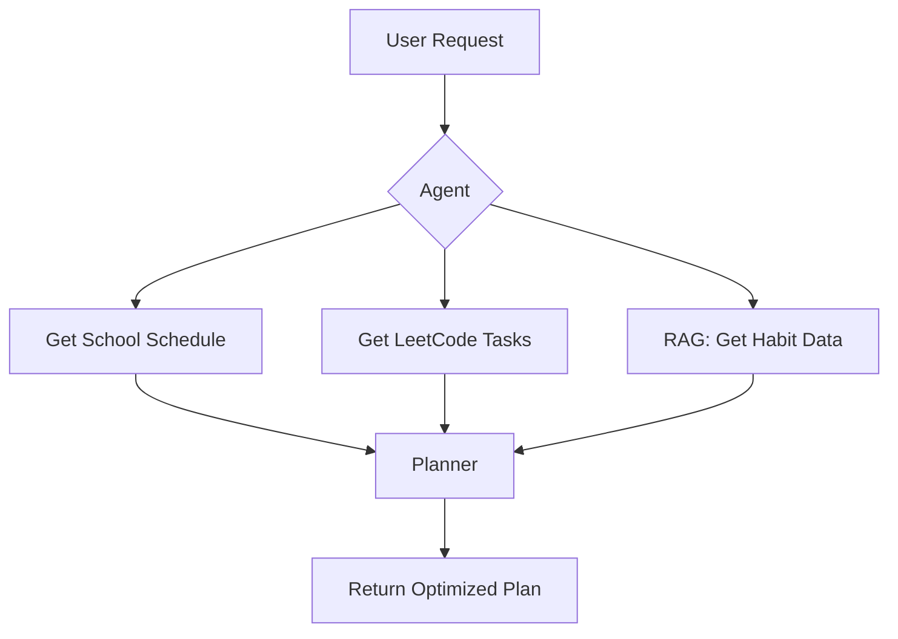

# 🧠 AI Planning Assistant

An AI Agent that helps you organize your **study schedule, LeetCode practice, and daily habits** — built with Python, MCP, and Starlette.

---

## 🚀 Features

- Fetch school schedule from API.
- Plan smart LeetCode practice sessions.
- Maintain habits using RAG (Retrieval-Augmented Generation).
- Real-time streaming responses with SSE.

---

## 🛠 Installation

### 1. Clone the repository & create a virtual environment

```bash
git clone https://github.com/nax-handle/mcp.git
cd mcp

python -m venv .venv
source .venv/bin/activate  # On Windows: .venv\Scripts\activate
```

### 2. Install dependencies

```bash
pip install -r requirements.txt
```

---

## ⚙️ Environment Variables

Create a `.env` file in the root folder:

```env
OPENAI_API_KEY=your-openai-api-key
DATABASE_URL=your-database-url
DEBUG=true
```

<!-- You can add more like `LEETCODE_API`, `SCHOOL_API`, or `HABIT_VECTOR_DB_URL` as needed. -->

---

## 🧪 Running the App

### Development Mode (auto-reload):

```bash
mcp run server.py
```

By default, the app will run on: [http://localhost:8000](http://localhost:8000)

---

## 📂 Project Structure

```bash
.
├── app/
│   ├── agents/              # MCP Agents
│   ├── services/            # External API calls (School, LeetCode, Habit...)
│   ├── schemas/             # Pydantic models
│   ├── main.py              # FastAPI/Starlette app
├── .env
├── requirements.txt
└── README.md
```

---

## ⚡ Example API Request

```bash
curl http://localhost:8000/schedule?user_id=123
```

The response will be in `application/json` or streamed via SSE if requested.

---

## 🤖 MCP Agent Workflow



---

## 📌 Notes

- The project uses **MCP** (Multi-agent Control Plane) to manage complex logic in a modular fashion.
- It's easy to extend and integrate with other APIs (Notion, Google Calendar, Zalo Reminder, etc.).
